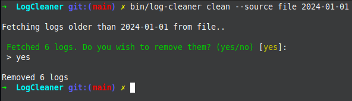

# Log Cleaner 

## Installation 

`composer require dante/log-cleaner`

## Usage 

`./vendor/dante/log-cleaner --source {source} {older-than}`

* {source} - "database" or "file"

Logs will be loaded from `foobar.log`, where I included some example logs. All of them but one are older than 2022-01-01, so that could be a good example.

* {older-than} - date in YYYY-MM-DD format

## Log format

In order to be properly parsed, logs have to follow this format:

`YYYY-MM-DD: {text}`

## Testing 

`./vendor/bin/phpunit tests`